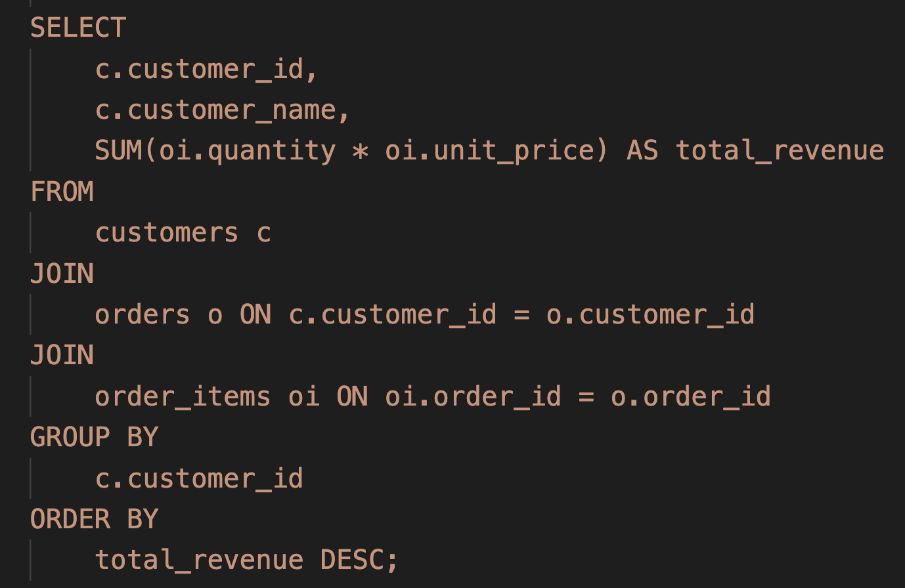
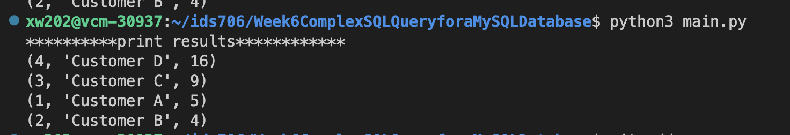

# Week6ComplexSQLQueryforaSQLDatabase

## Description
Python script interacting with SQLlite database. This project was generated from python template, which includes Makefile, requirements.txt, githubAction. It can automatically install, test, format, lint my change.

This project contains 4 tables: 
1. customers(customer_id, customer_name) 
2. orders(order_id, order_date, customer_id) 
3. order_items(order_item_id, order_id, product_id, quantity, unit_price) 
4. products(product_id, name)

After inserting some rows in these tables, I use the following 
code to query the total revenue generated by each customer, sorted in descending order of total_cost.

1. joins: 
We joined the customers, orders, and order_items tables based on their respective foreign key relationships (customer_id and order_id). 
2. Aggregation: 
We used the SUM function to calculate the total revenue for each customer. This involves multiplying the quantity of each item by its unit price and summing up these values for each order. 
3. Group BY: 
The result was then grouped by customer_id and customer_name from the customers table. This ensures that the aggregation is done for each customer. 
4. Sorting: 
Finally, we sorted the results in descending order based on the total revenue using the ORDER BY clause.

## Sample Output

